# Shale - Namma Pride 🏫

> **School Transparency & Pride Portal** — Empowering parents, celebrating students, building community trust.

A modern Android app built for **Vijayanagara Vivekananda Education Society**, Bengaluru. The app gives school administrators a platform to share daily meal updates, facility photos, student achievements, and announcements with parents in real time — in both **English and Kannada**.

---

## 📱 Screenshots

<table>
  <tr>
    <td align="center"><b>Home</b></td>
    <td align="center"><b>Meals</b></td>
    <td align="center"><b>Facilities</b></td>
  </tr>
  <tr>
    <td>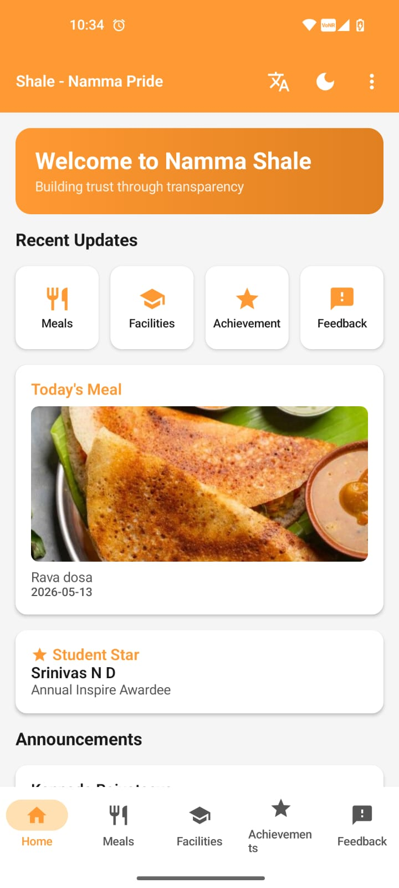</td>
    <td>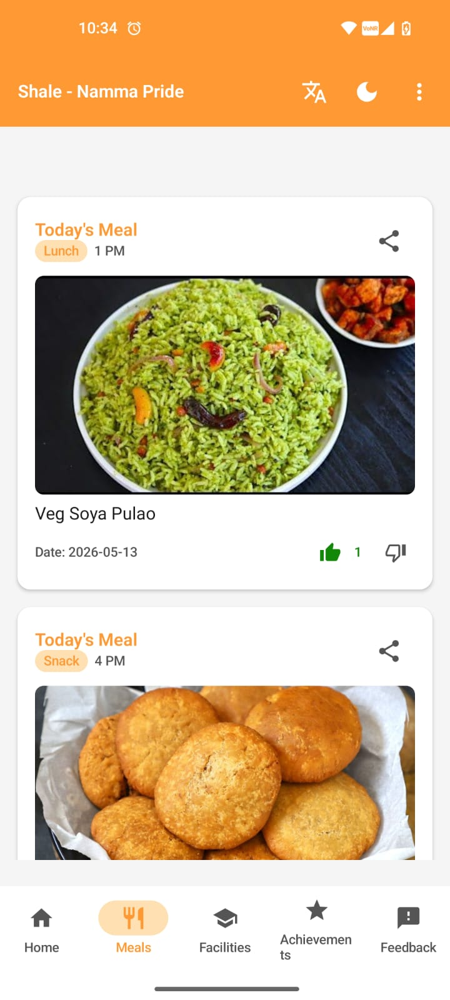</td>
    <td>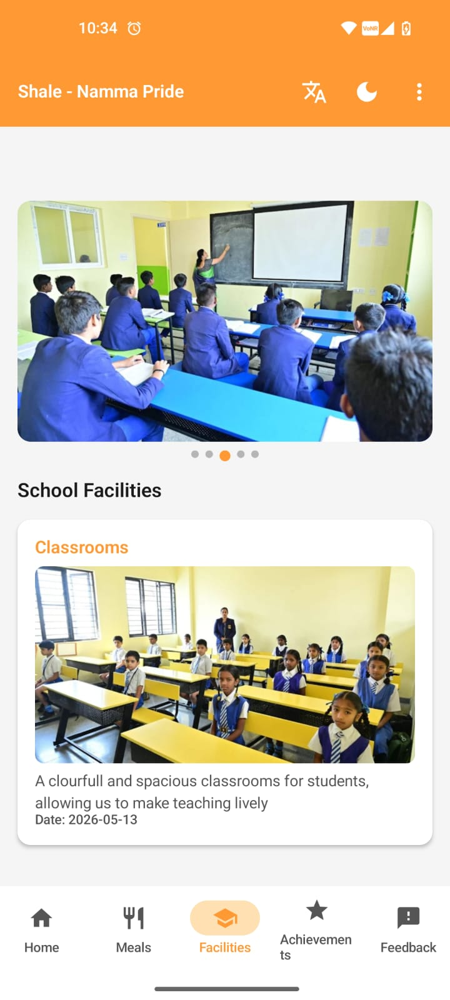</td>
  </tr>
  <tr>
    <td align="center"><b>Achievements</b></td>
    <td align="center"><b>Announcements</b></td>
    <td align="center"><b>Reports</b></td>
  </tr>
  <tr>
    <td>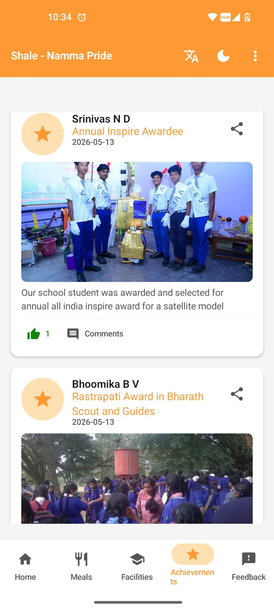</td>
    <td>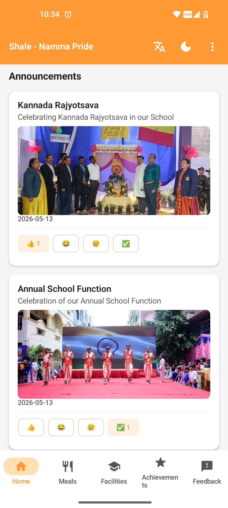</td>
    <td>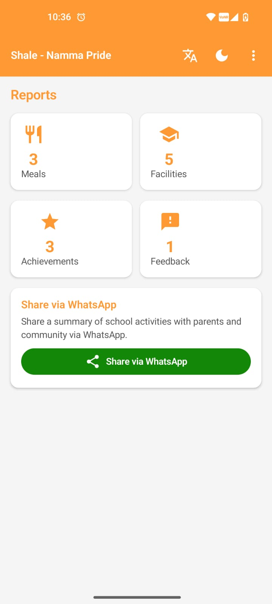</td>
  </tr>
  <tr>
    <td align="center"><b>Feedback (Dark)</b></td>
    <td align="center"><b>School Info</b></td>
    <td align="center"><b>Admin Panel (Dark)</b></td>
  </tr>
  <tr>
    <td>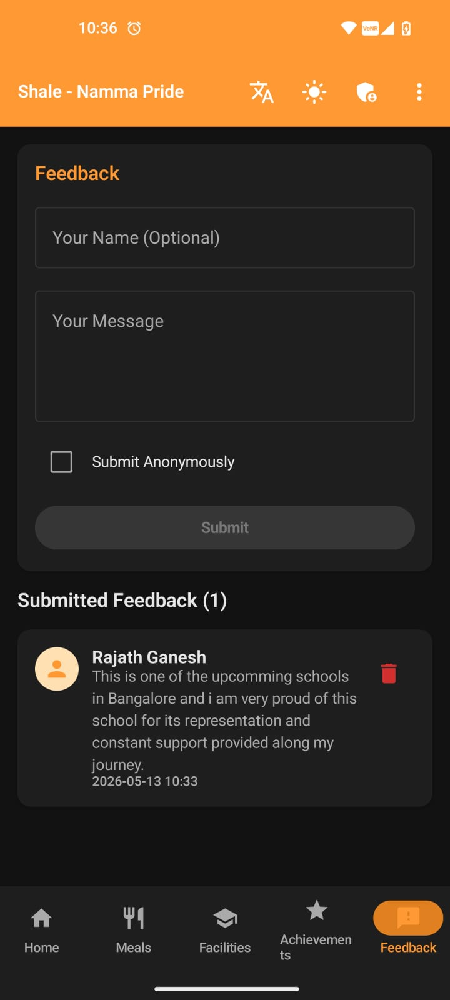</td>
    <td>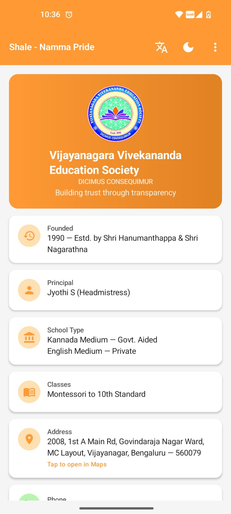</td>
    <td>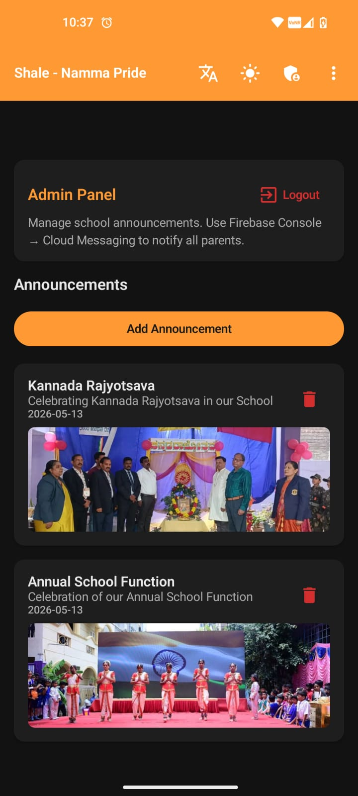</td>
  </tr>
  <tr>
    <td align="center"><b>Admin Login</b></td>
    <td align="center"><b>Home (Kannada)</b></td>
    <td></td>
  </tr>
  <tr>
    <td>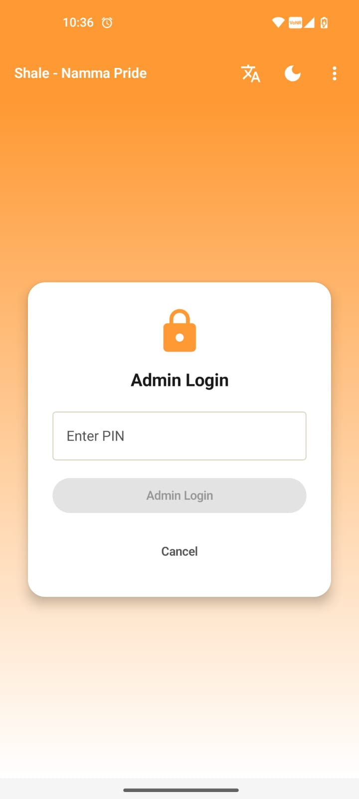</td>
    <td>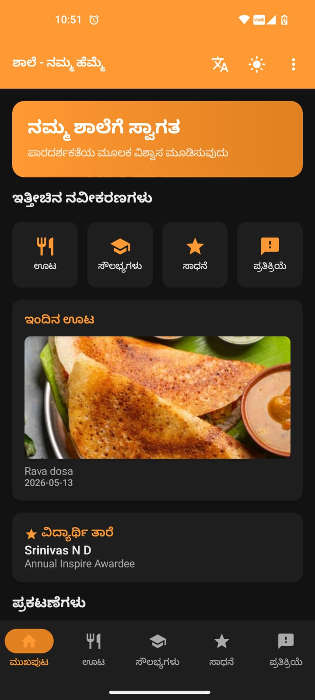</td>
    <td></td>
  </tr>
</table>

---

## ✨ Features

### For Parents
- 🍱 **Daily Meal Updates** — View today's breakfast, lunch, snack, and dinner with photos
- 🏫 **Facility Gallery** — Auto-scrolling photo tour of classrooms, labs, library, and sports facilities
- 🌟 **Student Achievements** — Celebrate student stars with profile photos and achievement showcases
- 📢 **Announcements** — School news with images and 4-emoji reactions (👍 😂 😢 ✅)
- 💬 **Comments** — React and comment on student achievements
- 📝 **Feedback Box** — Send suggestions to the school committee, anonymously if preferred
- 🌙 **Dark Mode** — Full dark theme support, persisted across app restarts
- 🇮🇳 **Bilingual** — Complete English & Kannada language toggle

### For Admin
- 🔐 **Secure PIN Login** — Admin access via a 4-digit PIN
- 📸 **Rich Media Posts** — Upload meal photos, facility images, achievement photos (profile + showcase)
- 📣 **Announcement Management** — Post announcements with images; delete when done
- 👁️ **Feedback Viewer** — Read and delete submitted parent feedback
- 📊 **Reports** — Live count of all entries, shareable summary via WhatsApp

### Technical Highlights
- ⚡ **Real-time data** — Firebase Realtime Database with offline persistence
- 🖼️ **Image compression** — Auto-compress & EXIF-rotate before uploading to Firebase Storage
- 👍 **Reactions** — Thumbs up/down on meals; 4-emoji reactions on announcements (one per device)
- 🔔 **Push Notifications** — FCM topic subscriptions (send from Firebase Console)
- 🔄 **Pull-to-refresh** — On all main content screens
- 🔍 **Full-screen viewer** — Tap any image to view it full screen

---

## 🛠️ Tech Stack

| Layer | Technology |
|---|---|
| Language | Kotlin |
| UI | Jetpack Compose + Material 3 |
| Architecture | MVVM (ViewModel + StateFlow) |
| Navigation | Navigation Compose |
| Backend | Firebase Realtime Database |
| Storage | Firebase Cloud Storage |
| Notifications | Firebase Cloud Messaging (FCM) |
| Image Loading | Coil |
| Preferences | DataStore |
| Min SDK | API 26 (Android 8.0) |

---

## 🏫 About the School

**Vijayanagara Vivekananda Education Society**
- 📍 2008, 1st A Main Rd, MC Layout, Vijayanagar, Bengaluru — 560079
- 📞 9696265860
- 🌐 [www.vves.org](https://www.vves.org)
- 👩‍💼 Principal: Jyothi S
- 🎓 Classes: Montessori to 10th Standard
- 🏛️ Kannada Medium (Govt. Aided) · English Medium (Private)
- 📅 Established 1990 by Shri Hanumanthappa & Shri Nagarathna

---

## 🚀 Getting Started

### Prerequisites
- Android Studio Meerkat or later
- JDK 17+
- A Firebase project (Blaze plan for Storage)

### Setup

1. **Clone the repository**
   ```bash
   git clone https://github.com/T0RA-47/Shale-Namma-Pride.git
   cd Shale-Namma-Pride
   ```

2. **Add Firebase config**

   Create your Firebase project at [console.firebase.google.com](https://console.firebase.google.com) and download `google-services.json`. Place it at:
   ```
   app/google-services.json
   ```
   > This file is excluded from the repo via `.gitignore` for security.

3. **Firebase services to enable**
   - Realtime Database (set rules to allow read/write)
   - Cloud Storage (Blaze plan required; set rules to allow read/write)
   - Cloud Messaging (for push notifications)

4. **Build & Run**

   Open the project in Android Studio, sync Gradle, and run on a device or emulator (API 26+).

---

## 🔐 Admin Access

The admin PIN is hardcoded in `AdminLoginScreen.kt`:
```kotlin
private const val ADMIN_PIN = "7777"
```
Change this before deploying to production.

---

## 📂 Project Structure

```
app/src/main/java/com/shalenammapride/
├── data/
│   ├── model/          # Data classes (Meal, Achievement, Announcement, ...)
│   └── repository/     # Firebase data access layer
├── service/            # FCM notification service
├── ui/
│   ├── components/     # Reusable composables (ShaleCard, NetworkImage, ...)
│   ├── navigation/     # NavGraph + Screen routes
│   ├── screens/        # Feature screens (home, meals, facilities, ...)
│   └── theme/          # Color, Typography, Theme (light + dark)
└── util/               # AppStrings (EN/KN), ImageUtils, LanguageManager
```

---

## 📋 PRD Source

This app was built as part of the **MindMatrix VTU Internship Program** — Project #95: *Android App Development using GenAI — Shale-Namma Pride (Education)*.

**Vision:** Allow school headmasters and SDMC members to showcase the "Daily Life" of the school, build a bridge of trust between the school and parents, and make the school a point of community pride.

---

## 📄 License

This project is built for educational and community use by Vijayanagara Vivekananda Education Society.

---

*Built with ❤️ for Namma Shale*
